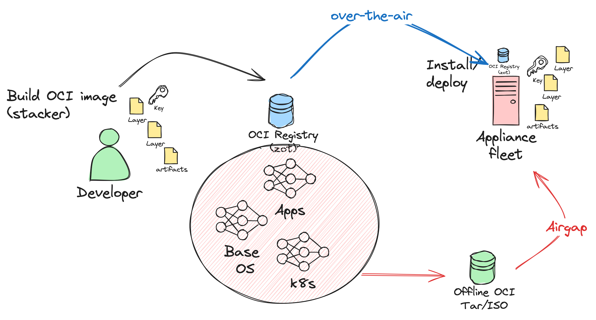
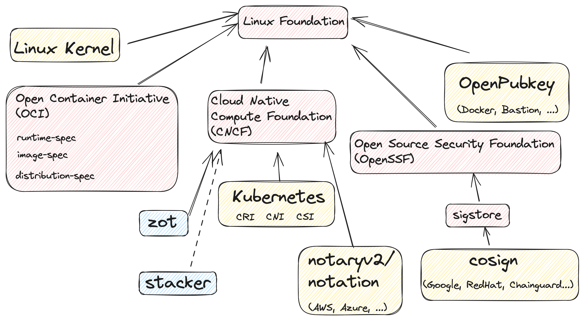
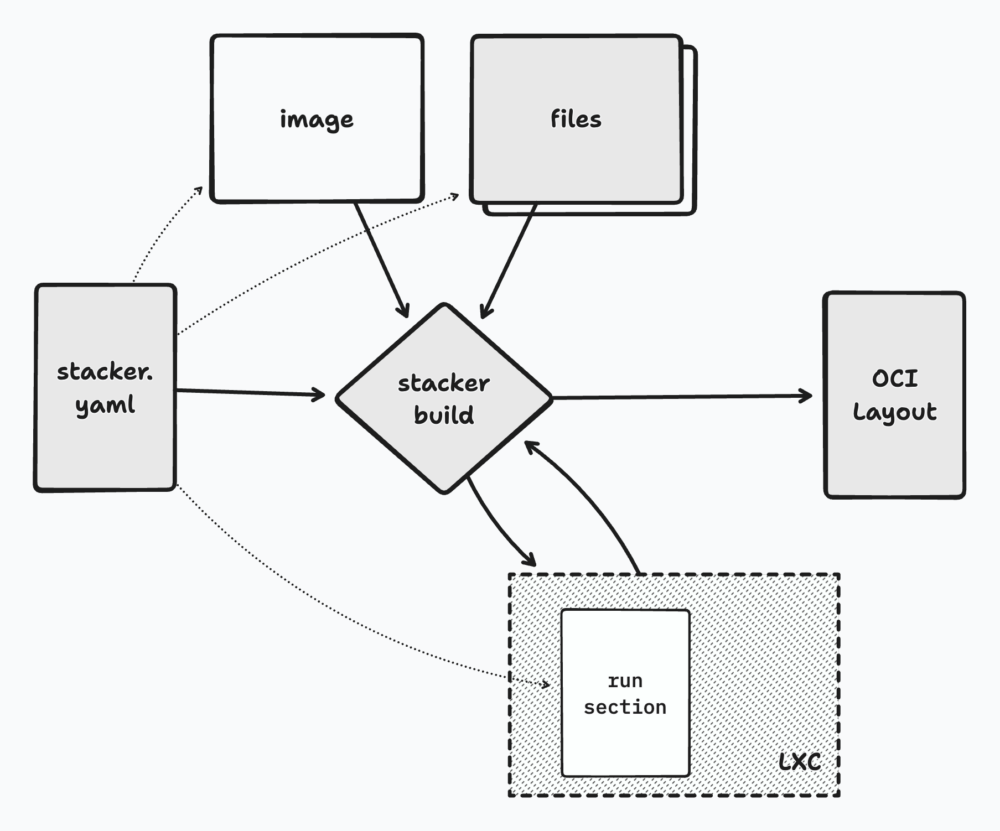
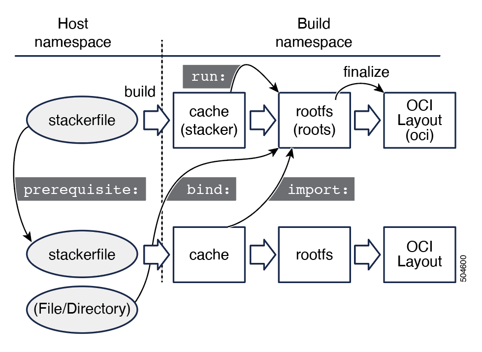

# What is Stacker

* OCI Native Container Image builder
* Built by Cisco, Open Source and public since day 1

```
commit 0d25e66e287718979982487b7f8ae45a3a606321
Author: Tycho Andersen <tycho@tycho.ws>
Date:   Wed Nov 29 17:42:50 2017 -0700

    initial commit

    Signed-off-by: Tycho Andersen <tycho@tycho.ws>
```

In heavy use by ACI, Nexus Dashboard and Nexus applications  for years.


---

# Why did we build this?

Build, Distribute and Run software as containers

---



---

# `OCI` "Standards"

* __image spec__: https://github.com/opencontainers/image-spec
* __distribution spec__: https://github.com/opencontainers/distribution-spec
* __runtime spec__: https://github.com/opencontainers/runtime-spec

---

# `OCI` Ecosystem

| Purpose | Redhat | Microsoft | Google | Docker| Cisco |
| --- | --- | --- | --- | --- | --- |
| Build | `buildah` | | `bazel` | `buildx` | `stacker` |
| Push/pull | `skopeo` | `oras` | `crane` | _`docker`_ | |
| Run | `podman` | | | `docker` | | 
| Sign | `cosign` | `notation` | `cosign` | `notaryv1` | |
| Registry | _`quay`_ | `acr` | _`gar`_ | _`distribution`_ | `zot` |

---




---


# Terms

- *container*
    - a process tree running in a restricted environment
- *image*
    - a packaged* directory tree to be used as the root filesystem for a container
    - includes some config for how to run the container, often ignored in k8s
- *base image*
    - an existing image to start from when building a new image
- *layer / content-addressed blob*
    - implementation detail of current container images, coarse way to share storage
- *runtime*
    - software that unpacks and mounts images and starts containers
- *OCI*
    - Open Source Spec for container image and runtime tools and data formats
    - includes a spec for on-disk image storage and for image repository API
- *OCI Layout*
    - just a directory somewhere on disk with one or more container images
- *LXC* (not LXD)
    - Open Source library for running and managing containers. Supports OCI among many image types. Builder agnostic.
- *Docker*
    - Open Source tool for building, running and managing containers, does many other things.
    - OCI specs (but not code) overlap significantly with docker

---

# Goals

- efficiency
  - small images

- trust
  - checking hashes

- understandability & maintainability


---

# How does stacker work?

- Get a base container image*

- Import any file deps you need

- Start a container
  - base image as the RFS
  - file deps accessible

- Run a script in that container to set things up

- Save any changes as a new image in an OCI Layout


. . .

Sounds a bit like "docker build," right?


---

# How is it different?

- Standalone, not a daemon

- OCI Native standard storage format

- Shell script based mutation
  - many changes in one "layer"

- Linux Only
  - Uses LXC and overlayfs

<!-- 

standalone vs docker daemon, doesn't require root

Ram covered appeal of standards

many changes in one layer is a tradeoff, convenience vs granularity
but having a separate layer for copying some file
-->

. . .

- Ability to move quickly with new features
  - Integrity support with squashfs and dm-verity
  - SBOM generation

<!-- 

minimal requirements (builder only, linux only) enables us to move quickly
instead of waiting for consensus and full cross platform support -->

---





---


# OCI layouts: what exactly are we building?

An OCI Layout with one image tagged "test":

```
% tree -h mylayout
[4.0K]  mylayout
├── [4.0K]  blobs
│   └── [4.0K]  sha256
│       ├── [ 82M]  1377df6593e020... # first layer of base image           <──┐
│       ├── [1.9M]  27ac08e0731341... # top layer of base image we imported <──┤
│       ├── [ 142]  5aa530963e08fc... # layer added during build            <──┤
│       ├── [1.0K]  eea0dfeb15fd39... # image manifest        ──>┐          ──>┘ <─┐
│       └── [ 988]  fb47d876bd9bc6... # config blob for image <──┘                 │
├── [ 301]  index.json                # index with tag "test" for image "eea0d" ──>┘
└── [  31]  oci-layout
```

---


# get a base image: from a registry

```yaml
myimage:
  from:
    type: docker
    url: docker://$YOUR_REGISTRY/c3/minbase:2.0.6
```

There are several options, but this is the most common.

<!-- 

a few options for the base image. probably the most common is to get it from a registry somewhere
For reproducibility and trust, you have to trust the registry and trust that tags don't change, or use hashes.

I have an example using the hash in backup if anyone only sort of trusts their registry.
-->

---

# Importing things

You probably need something new on top of that base image. Import it!

```yaml
myimage:
  from: ...
  import:
    - path: https://my_artifact_server/a_conf_file_that_should_really_be_in_git
      hash: a1b2c3d4e5f6...
      dest: /etc/a_conf_file
    - path: https://my_artifact_server/something_built_elsewhere
      hash: a1bff48feea6...
      dest: /bin/something
```

NOTE 👀 specify hashes so your build will fail if you aren't getting what you expect

. . .

This also works, but you have to trust that it will never change:

```yaml
myimage:
  from: ...
  import:
    - path:  https://example.com/foo_conf
      dest: /etc/conf
```

---

# Making changes: the `run` section

A script that runs in the container you have set up.

```bash
bat -n --decorations always 2.stacker.yaml
```


changes made to most files (except those under `/stacker`) are persisted in the final container image.

Deleting existing files will make them invisible to a container running in the final image,
but *will not* remove them from the image, base images are immutable.

Bash by default, but you could make it something else with a starting `#!`.

<!-- 

STYLE NOTE - yaml multiline string is best -->

---


# Imports with no dest and no hash

A "bare" import is just *available* to the container but you need to do extra work to put it in the final image:

```yaml
myimage:
  from: ...
  import:
    - https://example.com/foo.tgz
  run: |
    cd /stacker 
    # NOTE: stacker 1.0 moves imported files to /stacker/imports/ instead
    tar zxvf foo.tgz some_file_in_there
    cp some_file_in_there /somewhere_not_in_slash_stacker/
```

<!-- 

many older stacker files and files cargo culted from older files use this,
but you can be better than we were!

Is there sometimes a reason to do this? yes... sometimes you want just part of it
-->

. . .

The less we leave around the better

- useful for getting parts of tarballs

- run utility scripts that dont belong in final image from `/stacker/`

- size matters, but also security scan noise, and sometimes even real issues
    (think libraries for other platforms, test credentials, etc)

<!-- 

can also delete a file after using it, but that can be tricky to get right! -->

<!-- 

security scanners will raise bugs for windows libraries if we have them around in our images -->

---

# Debugging failures: what a failure looks like

```bash
bat -n --decorations always 3.stacker.yaml
```

. . .

```
stacker --oci-dir 3 build  -f 3.stacker.yaml
preparing image test...
copying /home/embrane/ssd/stacker-talk/example.tgz
loading docker://$YOUR_REGISTRY/c3/minbase:1.0.72
Copying blob 75cbc4cc1f40 skipped: already exists
Copying blob 13b0fc7ed078 skipped: already exists
Copying config e1cb0c4b1d done
Writing manifest to image destination
Storing signatures
+ tar zxvf /stacker/imports/example.tgz example.stacker.yaml
tar: example.stacker.yaml: Not found in archive
tar: Exiting with failure status due to previous errors
error: run commands failed: execute failed: exit status 2
error: exit status 1
```

---

# Debugging failures: how to learn more

>1. you can debug it like a regular shell script, `echo` etc.
>2. get in there and look around with `--shell-fail`

```
stacker build --shell-fail 3.stacker.yaml
...
+ tar zxvf /stacker/imports/example.tgz example.stacker.yaml
tar: example.stacker.yaml: Not found in archive
tar: Exiting with failure status due to previous errors
# 
```

. . .

```
# ls -l /stacker/imports
total 4
-rw-rw-r-- 1 root root 409 Nov  4 00:49 example.tgz
# tar zxvf /stacker/imports/example.tgz
1.stacker.yaml
2.stacker.yaml
3.stacker.yaml
# exit
error: run commands failed: execute failed: exit status 2
error: exit status 1
```

---

# A build container: minimize final image

- multiple images per stackerfile
- `build_only` - doesn't output a tagged image
- import to copy from other built image

```bash
bat -n --decorations always 4.stacker.yaml 
```

---

# really minimal: from scratch

```bash
bat -n --decorations always 1.stacker.yaml
```

<!-- starts with nothing, no way to run a script, just what you can import -->

---

# Importing vs. building

- Be aware of the tradeoffs
  - speed vs. trust
  - build time complexity vs debug time complexity

- Stackerfile can describe everything, including full build environment
  - this is great for tracking down issues

- Importing too many things built elsewhere makes your image just another layer to dig through

- But builds can be slow!

<!-- 

build can be slow, building separately  -->

---

# Substitutions

In general it is best to have the stacker file stand on its own.

However, if you have a lot of stacker files with common values, you might want to use subsitutions sparingly.

`stacker build --substitute C3_VERSION=1.0.72`

```yaml
myimage:
  from:
    type: docker
    url: docker://$YOUR_REGISTRY/c3/minbase:${{C3_VERSION}}
```

<!-- 

now if you want to know exactly what a stackerfile builds, you are looking in at least two places -->

---

# Where to get stacker

## current release version

<https://stackerbuild.io>

## latest release candidate

<https://github.com/project-stacker/stacker/releases>

---

# How to make sure it'll work

- Missing dependencies can cause hard to understand error messages.

`stacker check` to the rescue

```sh
$ stacker check
os/kernel: Linux 6.2.0-26-generic #26~22.04.1-Ubuntu SMP PREEMPT_DYNAMIC Thu Jul 13 16:27:29 UTC 2
error: /local/rchincha/tmp/s/roots: roots dir (--roots-dir) path uses symbolic links, use "/data/hdd/rchincha/tmp/s/roots" instead
error: exit status 1 
```

<!-- 

kernel vers etc
-->

---

# Other features to use as you get more ambitious

- bind mounting
- stacker grab
- dependencies between stacker files

---

# Stacker convert & SBOM

---


# Thanks

## how to get in touch / get help

<https://github.com/project-stacker/stacker>

Stacker101 webex channel

---

# backup slides

---

# building different layer types

`stacker build --layer-type squashfs`

use `atomfs` to mount

runtime support in the future

---

# get a base image: from a local OCI layout

```yaml
from:
  type: oci
  url: oci:/local/path/to/oci/imagename:v1.0
```

<!-- backup because not recommended, not reproducible without extra work -->

---

# backup: get a base image with hash

paranoid? use the manifest hash of the layer:

```bash
bat -n --decorations always 2.stacker.yaml
```


---

# backup architecture slide



